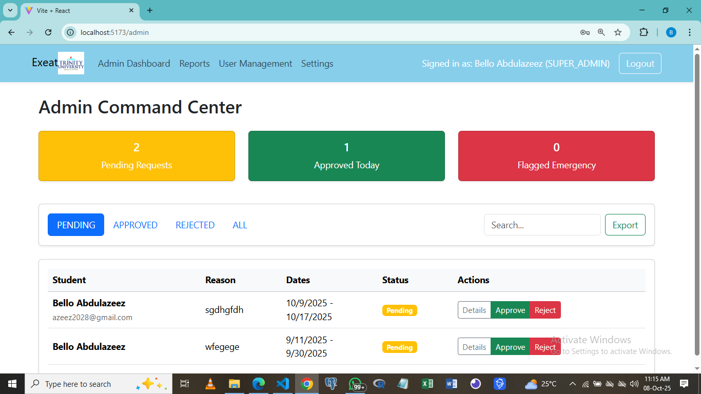
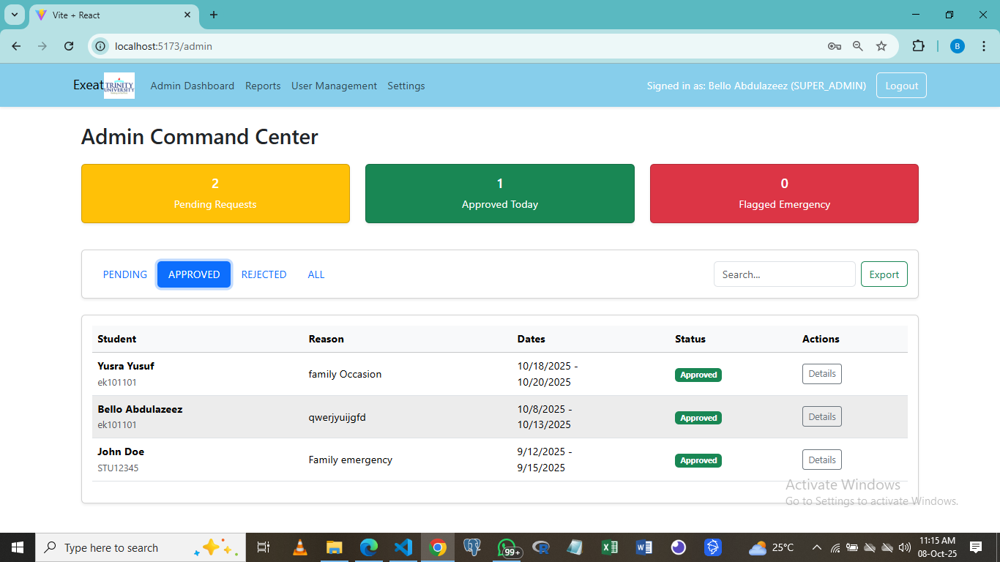
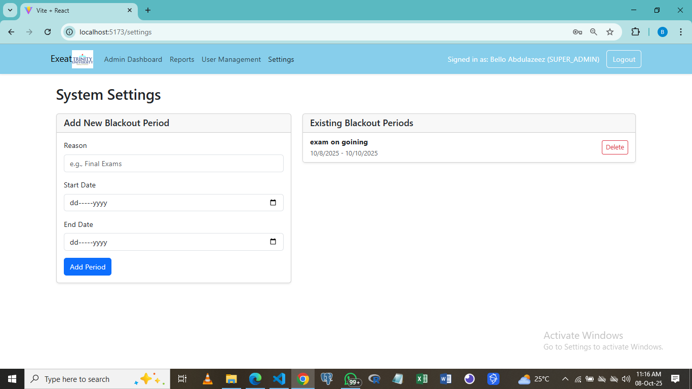
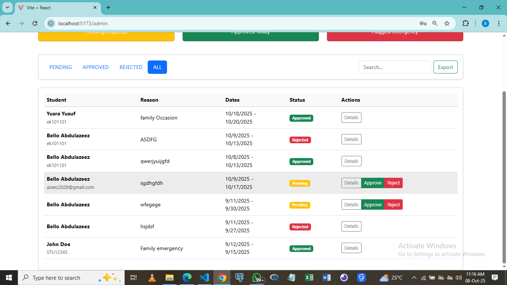

# Exeat Management System

A full-stack web application designed for educational institutions to efficiently manage student exeat (leave) requests. The system provides a seamless digital workflow, from student submission to administrative approval, complete with role based access control and automated notifications.

**Live Demo:** [Link to your deployed Vercel URL will go here]

---

## Application Preview

Below are several screenshots showcasing the application's user interface and key features for different roles.

**1. Admin Command Center**
*The main dashboard for administrators, featuring KPI cards, live search, and a filterable queue of pending requests.*

**2. Detailed Request Modal**
*Admins can view all details of a specific request, including a full audit trail of who actioned it and when.*

**3. User Management (Super Admin)**
*Super Admins have access to a panel to view all users, change roles, and create new admin accounts.*

**4. System Settings (Super Admin)**
*The settings page allows Super Admins to define application-wide rules, such as "Blackout Dates" for exams.*

**5. Student Request History**
*A tabbed interface where students can view their past requests and check for notifications.*

---

## Core Features

The application is built with a clear separation of roles, providing a tailored experience for each user type.

### For Students:
*   **Secure Registration & Login:** Students can create and access their accounts securely.
*   **Intuitive Dashboard:** A welcoming dashboard that shows the status of their most recent request.
*   **Smart Request Form:** An easy-to-use form for submitting new exeat requests, complete with date validation and type selection (e.g., Overnight, Emergency).
*   **Blackout Date Awareness:** The form proactively informs students of and blocks submissions during administrative "blackout" periods (like exams).
*   **Request History:** A clean, tabbed interface to view the status of all past and pending requests.
*   **Cancel Pending Requests:** Students have the ability to withdraw their own requests if they have not yet been processed.
*   **Notification Center:** Receive real-time notifications for status updates on their requests.
*   **Profile Management:** Students can update their name and change their password.

### For Admins:
*   **Admin Command Center:** A central dashboard showing key statistics (KPIs) like pending requests, approvals today, and emergency flags.
*   **Powerful Request Queue:** View all student requests with robust filtering by status (Pending, Approved, etc.) and type.
*   **Live Search:** Instantly find a student's requests by searching for their name or matriculation number.
*   **Detailed View:** A "Details" modal provides a comprehensive view of each request, including a full audit trail (who approved/rejected and when).
*   **One-Click Decisions:** Approve or reject requests directly from the dashboard. Rejections require a comment to ensure clear communication.
*   **Data Export:** Export the filtered list of requests to a CSV file for record-keeping or offline analysis.

### For Super Admins:
*   **Full Admin Capabilities:** Access to all features available to standard Admins.
*   **User Management Dashboard:** A secure panel to view all users, create new accounts (especially for Admins), and change any user's role.
*   **System Settings:** A dedicated page to configure application-wide rules, such as creating and managing "Blackout Dates."

### System-Wide Features:
*   **Role-Based Access Control (RBAC):** Secure backend architecture ensures users can only access the data and perform actions appropriate for their role.
*   **Automated Email Notifications:** Upon approval or rejection, the system automatically sends a professionally formatted email to the student.

---

## Tech Stack

### Frontend:
*   **Framework:** React (with Vite)
*   **Routing:** React Router
*   **Styling:** Bootstrap & React-Bootstrap
*   **State Management:** React Context API
*   **HTTP Client:** Axios
*   **Charting:** Chart.js

### Backend:
*   **Framework:** Node.js & Express.js
*   **Database ORM:** Prisma
*   **Authentication:** JSON Web Tokens (JWT) & bcrypt.js
*   **Email Service:** Nodemailer
*   **Data Export:** json2csv

### Database:
*   **Database:** PostgreSQL

---

## 👤 Author

*   **Bello Abdulazeez** - [(https://github.com/irish2023)]